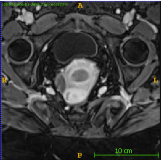
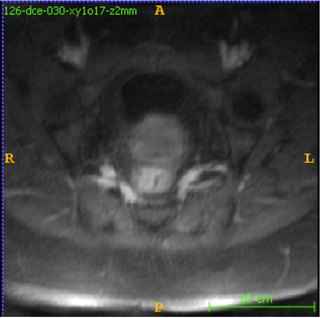
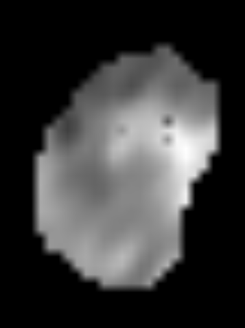
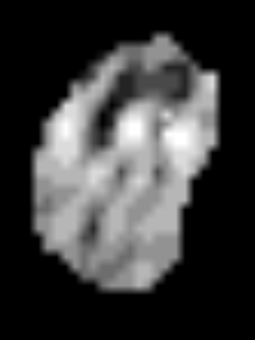
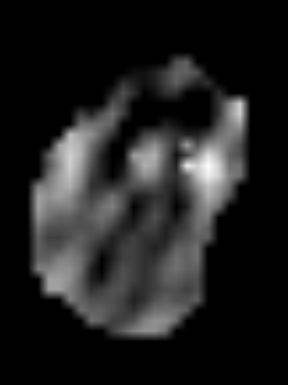
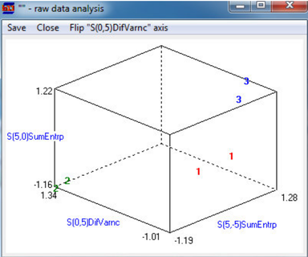
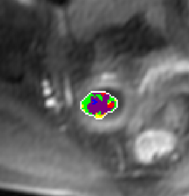
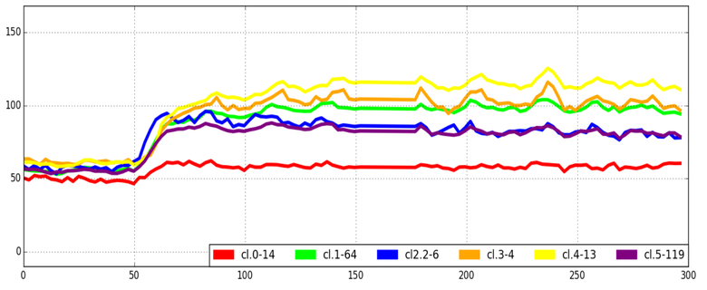

# EndoMR-TextureAnalysis
A repository for texture-based analysis of MR images in endometrial carcinoma classification. Implements extraction of texture features from pharmacokinetic parameter maps derived from DCE-MRI, ADC, and VIBE modalities. Includes tools for supervised and unsupervised classification to aid in tumor grading and characterization.

## Overview
This repository contains tools and algorithms for texture analysis of MR images for endometrial carcinoma classification. The approach is based on a research study that evaluated texture parameters computed from blood pharmacokinetic maps derived from DCE-MRI as potential biomarkers for cancer characterization.

## Background
The method analyzes various MRI modalities including:
- Dynamic Contrast-Enhanced (DCE) MRI parameter maps (p₁, p₃, p₄, t₀)
- Apparent Diffusion Coefficient (ADC) maps
- T1-weighted VIBE images

Our computational approach extracts texture features from these images and applies both unsupervised clustering and supervised classification (LDA) to correlate image features with histological tumor grades.

## Study Design
The research was conducted on data from 14 endometrial carcinoma patients with histologically verified diagnosis. Each patient's dataset contained six different image types: four pharmacokinetic parameter maps derived from DCE-MRI signal modeling, and two conventional MR images (ADC and VIBE). The histological grade provided by pathologists after tumor extraction served as ground truth for supervised learning experiments.

## Methodology
1. **Image Acquisition**: 
   - 1.5T MRI system (Siemens Avanto)
   - VIBE: 192×192 matrix, 48 slices, 1.3×1.3×2.0 mm³ voxels
   - DCE-MRI: 256×256 matrix, 12 slices, 1.17×1.17×5.0 mm³ voxels, 160 volumes at 2.49s intervals
   - DWI: 128×128 matrix, 20 slices, 2.34×2.34×6.0 mm³ voxels

 
   <table align="center">
     <tr>
       <td align="center"></td>
       <td align="center"></td>
        <td align="center"></td>
       <td align="center"></td>       
     </tr>
     <tr>
       <td align="center"><i>a)</i></td>
       <td align="center"><i>b)</i></td>
       <td align="center"><i>c)</i></td>
       <td align="center"><i>d)</i></td>
     </tr>
     <tr>
       <td colspan="4" align="center"><i>Selected cross-sections of 3D volumes for patient #126: 
       a) VIBE, b) VIBE with marked region of interest (red circle) c) ADC, d) DCE-MRI.</i></td>
     </tr>      
   </table>
 

2. **Signal Modeling**:
   - 6-parameter pharmacokinetic model fitted to DCE-MRI time courses
   - Parameters include signal baseline (p₀), amplitude (p₁), transition slope (p₂), decay rate (p₃), initial rise (p₄), and bolus arrival time (t₀)
     
      
     <table align="center">
     <tr>
       <td align="center"></td>
       <td align="center"></td>
       <td align="center"></td>
     </tr>
     <tr>
       <td align="center"><i>a)</i></td>
       <td align="center"><i>b)</i></td>
       <td align="center"><i>c)</i></td>
     </tr>
     <tr>
       <td colspan="4" align="center"><i>Signal model parameters definition: a) 2D DCE-MRI slice with
marked cross-shaped pixels featuring different signal response: 1- blood vessel, 2-non-enhanced tissue (fat), 3- endometrium, b)&nbsp;signals corresponding to ROIs, red thick line - average signal from artery (ROI #1), black thick line - average signal in non-enhanced tissue (ROI #2), blue thick line average signal from endometrium (ROI #3), c)&nbsp;illustration of the model parameters meaning.</i></td>
     </tr> 
   </table>
    
   
3. **Texture Analysis**:
   - Approximately 300 texture features computed using MaZda software
   - Features derived from parameter distributions within ROIs marked by radiologists
   - Feature selection using Fisher coefficient, mutual information, and classification error minimization

    
    <table align="center">
     <tr>
       <td align="center"></td>
       <td align="center"></td>
       <td align="center"></td>
       <td align="center"></td>       
     </tr>
     <tr>
       <td align="center"><i>a)</i></td>
       <td align="center"><i>b)</i></td>
       <td align="center"><i>c)</i></td>
       <td align="center"><i>d)</i></td>
     </tr>
     <tr>
       <td colspan="4" align="center"><i>Pharmacokinetic derived parameter maps for patient #197: a) p1, b)t0, c) p3, d) p4.</i></td>
     </tr>      
   </table>
    

3. **Classification and Clustering**:
   - Linear Discriminant Analysis for supervised grade classification
   - k-means clustering for unsupervised tissue characterization
   - Evaluation using resubstitution and leave-one-out cross-validation errors

    
   <table align="center">
     <tr>
       <td align="center"></td>
       <td align="center"></td>
     </tr>
     <tr>
       <td align="center"><i>a)</i></td>
       <td align="center"><i>b)</i></td>
     </tr>
     <tr>
       <td colspan="4" align="center"><i>Scatterplots for first three Fisher-coefficient-ranked texture features obtained for the parameter maps of the training set: a)&nbsp;p1&#160;(F=93.6 for the three classes), b) ADC (F=64.7 for the three classes)</i></td>
     </tr> 
   </table>
    

## Key Results
- Parameter p₃ texture map showed best discrimination between carcinoma grades (resubstitution error: 14.3%, cross-validation error: 21.4%)
- ADC maps also demonstrated good classification performance
- Well-separated clusters in unsupervised analysis confirmed information content in texture features
- Colored visualization of clustering results was assessed as useful by radiologists for anatomical and pathophysiological exploration

 
<table align="center">
     <tr>
       <td align="center"></td>
       <td align="center"></td>
     </tr>
     <tr>
       <td align="center"><i>a)</i></td>
       <td align="center"><i>b)</i></td>
     </tr>
     <tr>
       <td colspan="4" align="center"><i>Average signals measured inside ROI for patient #157. The whole signal (for each DCE examination) range divided into five clusters: a) region of interests with pixels assigned to each cluster marked with different colour, b) averaged time-courses plots in clusters.</i></td>
     </tr> 
   </table>
    

## Potential Applications
- Preoperative assessment of endometrial carcinoma grade
- Non-invasive tumor characterization
- Support for surgical therapy planning
- Potential transferability to other tumor systems
- Contribution to personalized modeling of human blood-vessel systems in cancer

## Limitations
- Small sample size (pilot study with 14 patients)
- Need for validation on larger datasets
- Manual ROI selection requiring expert knowledge

## Future work
- Application of convolutional neural networks (CNNs) for automatic feature extraction instead of manually designed texture features
- Implementation of tumor region segmentation using U-Net architecture, eliminating the need for manual ROI delineation
- Utilization of transfer learning techniques on pre-trained models to improve classification with limited sample size
- Development of AI interpretation methods (e.g., activation maps, GradCAM) for better understanding of significant regions in MR images
- Integration of multimodal data (DCE, ADC, VIBE) in a single end-to-end deep learning model
- Application of federated learning techniques to enable collaboration between research centers without sharing sensitive patient data

## Publications
1. Texture Parameters of DCE-Derived Blood Pharmacokinetic Maps as Possible Biomarkers of Endometrial Carcinoma Grade, M. Kociński, A. Materka, A. Lundervold, Helga B. Salvesen, Sigmund Ytre-Hauge, Ingfrid S. Haldorsen, Magnetic Resonance Materials in Physics, Biology and Medicine, Volume 19, Issue 1, Suplement, September 2016

1. Texture analysis of 2D spatial distribution of blood pharmacokinetic model parameters for endometrial carcinoma classification, M. Kociński, A. Materka, A. Lundervold, Helga B. Salvesen, Sigmund Ytre-Hauge, Ingfrid S. Haldorsen, SPA 2016, Signal Processing Algorithms, Architectures, Arrangements, and Application, 21-23 September 2016, Poznan, Poland, IEEE Conference, ([link](https://ieeexplore.ieee.org/document/7763593/))
